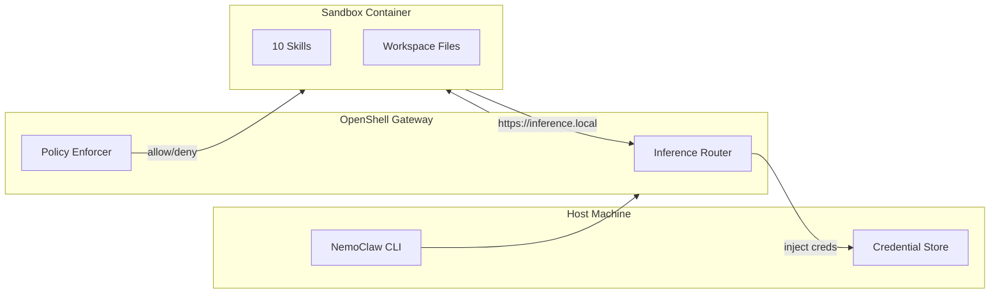
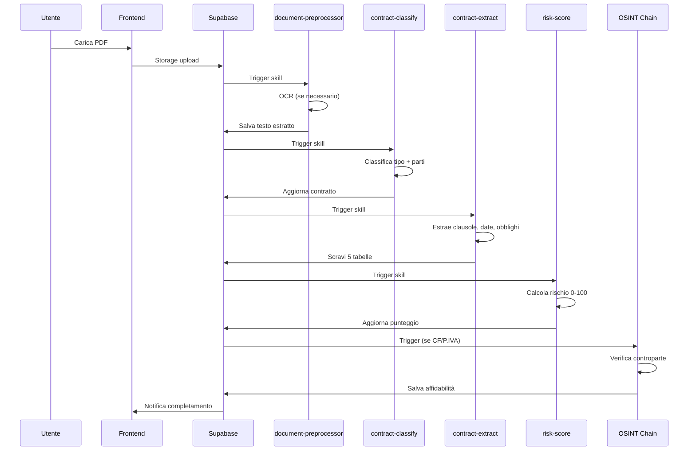
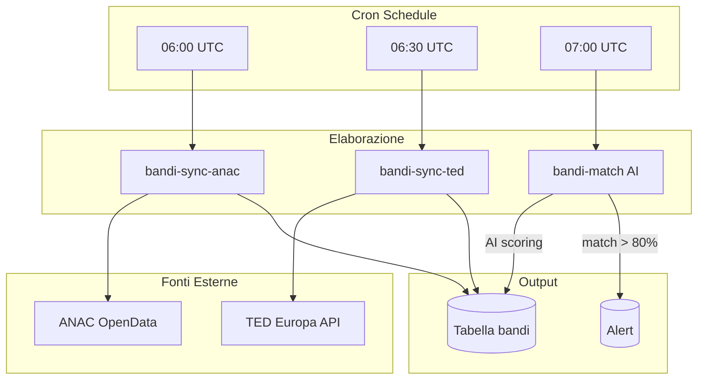

# Terminia-Nemoclaw

Piattaforma AI con agenti sandboxed per l'intelligence contrattuale e OSINT, dedicata alle PMI italiane.

## Panoramica

Terminia-Nemoclaw è il backend AI dell'ecosistema Terminia. Combina:

- **Inference multi-modello** — 4 server llama.cpp dietro proxy LiteLLM
- **Agenti sandboxed** — NVIDIA NemoClaw/OpenShell con politiche di sicurezza deny-by-default
- **10 skill specializzate** — Analisi contratti, OSINT, monitoraggio bandi di gara
- **REST API** — Express.js con auth, rate limiting, streaming chat
- **Integrazioni esterne** — VIES, ANAC, TED Europa, Supabase

## Architettura

```mermaid
flowchart TB
    subgraph Frontend["Frontend (Next.js)"]
        F1[Dashboard]
    end

    subgraph Supabase["Supabase"]
        DB[(PostgreSQL)]
        STG[Storage]
        AUTH[Auth]
    end

    subgraph Nemoclaw["Terminia-Nemoclaw"]
        subgraph API["REST API (Express)"]
            A1[/api/analyze]
            A2[/api/chat]
            A3[/api/osint]
            A4[/api/documents]
        end

        subgraph Gateway["OpenShell Gateway :18789"]
            GW[Sandbox Manager]
        end

        subgraph Sandbox["OpenClaw Sandbox (terminia)"]
            S1[Contract Pipeline]
            S2[OSINT Skills]
            S3[BandoRadar]
        end

        subgraph LiteLLM["LiteLLM Proxy :4000"]
            LLM[Model Router]
        end

        subgraph Models["llama.cpp Servers"]
            M1[Orchestrator 8B :8083]
            M2[Worker 4B :8084]
            M3[OCR 8B :8086]
        end
    end

    F1 --> Supabase
    Supabase -->|service role| A4
    A1 --> GW
    A2 --> GW
    A3 --> GW
    GW --> Sandbox
    Sandbox -->|inference.local| LLM
    LLM --> M1
    LLM --> M2
    LLM --> M3
    Sandbox --> Supabase
```

## Stack Tecnologico

| Componente | Tecnologia |
|------------|-----------|
| **Runtime** | Node.js 22 + TypeScript |
| **Sandbox** | NVIDIA NemoClaw + OpenShell |
| **AI Models** | llama.cpp (Nemotron 8B/4B, NuMarkdown 8B) |
| **API Proxy** | LiteLLM (OpenAI-compatible) |
| **Database** | Supabase (PostgreSQL + Storage) |
| **API Framework** | Express.js |
| **Container** | Docker Compose |
| **Deployment** | Dokploy |

## Componenti Principali

### Nebula — Stack Inference

Quattro server llama.cpp dietro proxy LiteLLM:

| Servizio | Modello | Porta | Scopo |
|----------|---------|-------|-------|
| Orchestrator | Nemotron-Orchestrator-8B | 8083 | Ragionamento complesso, analisi contratti |
| Worker | NVIDIA-Nemotron3-Nano-4B | 8084 | Esecuzione rapida |
| OCR | NuMarkdown-8B-Thinking | 8086 | Estrazione testo da documenti scansionati |

### NemoClaw — Piattaforma Agenti

Gateway OpenShell che gestisce il lifecycle di sandbox containerizzati dove girano le skill OpenClaw.



### Skill OpenClaw

Dieci skill TypeScript in `/sandbox/.openclaw/skills/`:

| Categoria | Skill | Descrizione |
|-----------|-------|-------------|
| **Utility** | `document-preprocessor` | PDF/DOCX/immagine → testo (OCR) |
| **Contratti** | `contract-classify` | Classificazione tipo e identificazione parti |
| **Contratti** | `contract-extract` | Estrazione clausole, obblighi, scadenze |
| **Contratti** | `contract-risk-score` | Calcolo punteggio rischio (0-100) |
| **OSINT** | `osint-cf` | Validazione Codice Fiscale (locale) |
| **OSINT** | `osint-vat` | Validazione P.IVA UE via VIES |
| **OSINT** | `osint-anac-casellario` | Verifica annotazioni ANAC |
| **BandoRadar** | `bandi-sync-anac` | Sync bandi italiani da ANAC |
| **BandoRadar** | `bandi-sync-ted` | Sync bandi UE da TED Europa |
| **BandoRadar** | `bandi-match` | Matching AI bandi vs profilo aziendale |

## Funzionamento

### Pipeline Analisi Contratto



### BandoRadar — Sync Giornaliero



## Sicurezza

### Isolamento Sandbox

| Layer | Policy |
|-------|--------|
| **Network** | Deny-by-default, solo whitelist approvata |
| **Filesystem** | `/sandbox` e `/tmp` scrivibili, resto read-only |
| **Credentials** | Mai montate nel sandbox, inject via gateway |
| **Inference** | Intercept di `https://inference.local` con credenziali |

### Network Whitelist

Solo questi endpoint sono consentiti:

- `inference.local:443` — AI inference
- `*.supabase.co:443` — Database
- `ec.europa.eu:443` — VIES VAT validation
- `dati.anticorruzione.it:443` — ANAC OpenData
- `casellario.anticorruzione.it:443` — ANAC Casellario
- `ted.europa.eu:443`, `api.ted.europa.eu:443` — TED Europa
- `api.telegram.org:443` — Telegram bot

## Setup Rapido

### Prerequisiti

- Docker + Docker Compose
- Node.js 22 (host)
- NVIDIA NemoClaw CLI installata

### Configurazione

```bash
# 1. Crea rete Docker condivisa
./nebula/create-network.sh

# 2. Configura variabili d'ambiente
cp nebula/.env.example nebula/.env
cp nemoclaw/.env.example nemoclaw/.env
# Editor: aggiusta percorsi modelli e credenziali

# 3. Avvia stack inference
cd nebula && docker compose up -d

# 4. Onboarding NemoClaw (wizard guidato)
nemoclaw onboard

# 5. Upload skill, workspace, env, cron
cd nemoclaw && ./setup.sh
```

### Health Check

```bash
curl http://localhost:8083/health  # orchestrator
curl http://localhost:8084/health  # worker
curl http://localhost:8086/health  # OCR
curl http://localhost:4000/health  # litellm-proxy
curl http://localhost:18789/health # openshell-gateway
curl http://localhost:3100/api/health # REST API
```

## Workspace — Personalità Agente

I file in `workspace/` definiscono la personalità dell'assistente AI:

- `SOUL.md` — Missione, regole comportamentali, competenze
- `IDENTITY.md` — Nome (Terminia), presentazione
- `AGENTS.md` — Flussi di orchestrazione skill
- `USER.md` — Template profilo aziendale

L'agente risponde sempre in **italiano**, con tono professionale e competente.

## API Endpoints

| Endpoint | Autenticazione | Descrizione |
|----------|----------------|-------------|
| `GET /api/health` | No | Health check |
| `POST /api/analyze` | Sì | Analizza documento contratto |
| `POST /api/chat` | Sì | Chat con orchestrator (SSE streaming) |
| `POST /api/osint` | Sì | Verifica controparte (CF, VAT, ANAC) |
| `POST /api/ocr` | Sì | OCR su immagine/PDF |
| `POST /api/documents` | No* | Upload documento |
| `POST /api/notifier/run` | Secret | Trigger notifiche scadenze |

*Upload pubblico con rate limiting per fase registrazione

## Deployment

- **Platform**: Dokploy
- **Workflow**: Git push to `main` → auto-deploy
- **Exposure**: Cloudflare Tunnel → Traefik → services

| Dominio | Routes to |
|---------|-----------|
| `ai.pezserv.org` | litellm-proxy:4000 |
| `nemoclaw.pezserv.org` | terminia-api:3100 |
| `terminia.pezserv.org` | frontend:3004 |

## Licenza

Proprietario — Terminia Project

## Supporto

Per problemi o domande, consultare la documentazione in `docs/` o aprire issue nel repository.
